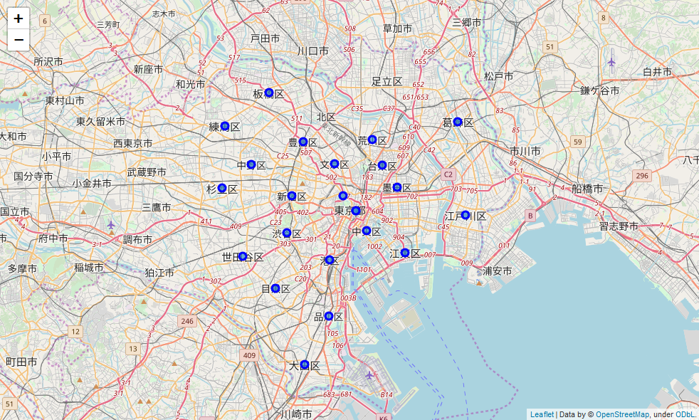
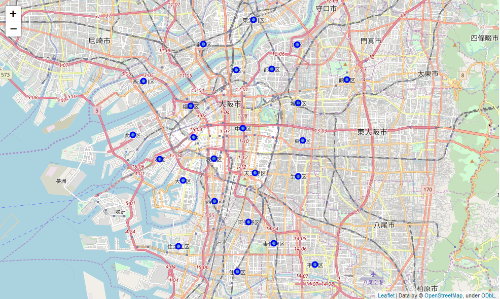
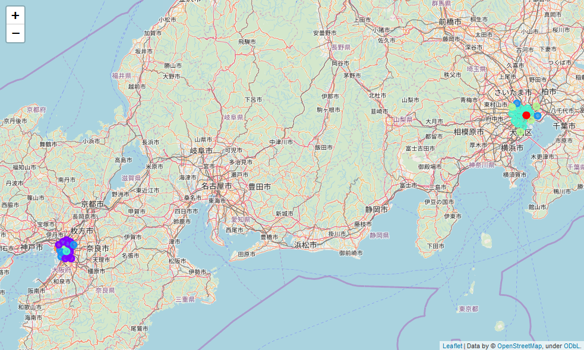
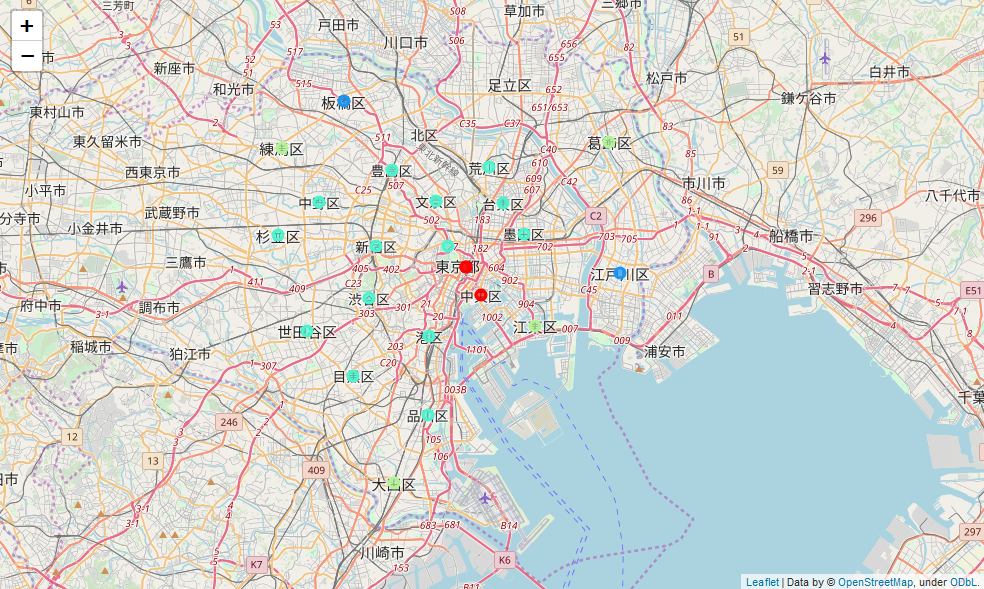
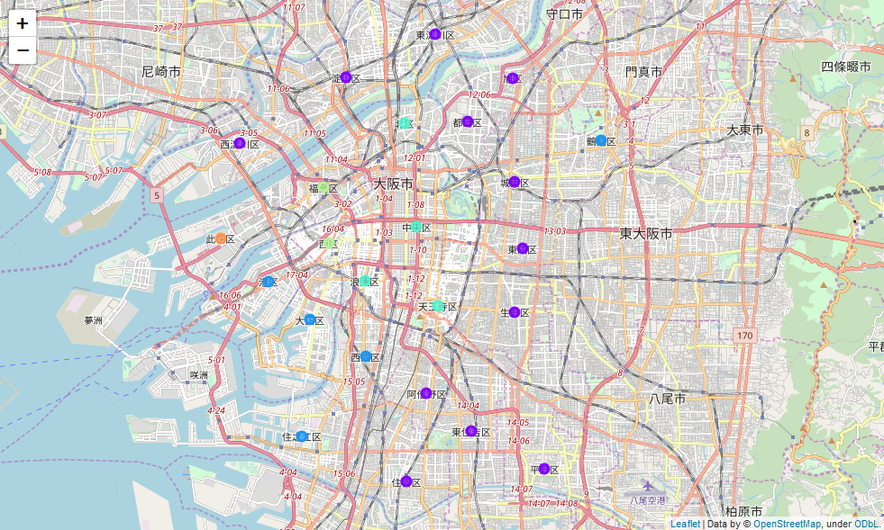

# Applied Data Science Capstone Project

- [Applied Data Science Capstone Project](#applied-data-science-capstone-project)
  - [Introduction](#introduction)
  - [Data](#data)
  - [Methodology](#methodology)
  - [Results](#results)
  - [Discussion](#discussion)
  - [Conclusion](#conclusion)

## Introduction

This is the final project for the IBM Data Science Professional Specialization course on Coursera. I will be using what I have learned about using location data and machine learning algorithms.

Tokyo and Osaka are two of Japan's largest cities.
Tokyo is located in the Kanto (East) region of Japan, while Osaka is located in the Kansai (West) region of Japan.

As two of the largest cities in Japan, it makes me wonder whether how the two cities are similar or differ from each other based on the nearby venues.

This project will use machine learning techniques to try and figure that out.

## Data

I will be obtaining my data from the web by scraping websites for data of the various wards in each cities, and their coordinates.

The data will be loaded onto a dataframe with columns for city, ward, latitude and longitude.

I will then use Foursquare's API to grab data of nearby venues for each ward.

The data will then be cleaned and formatted for use with a machine learning clustering algorithm.

After cluster labels have been assigned for each row of data, I will merged it with the original dataframe to show the names of the city and ward.

The clusters will then be visualised on a map using the folium library.

We should then be able to compare the clusters in the two cities for similarities or differences.

## Methodology

The first step is to gather the data required to do the analysis.
To do this, I used the Beautiful Soup library to scrape relevant wikipedia pages for the list of wards for Tokyo and Osaka.

Then, using the geocoder library and passing in the names of the ward, I was able to obtain coordinates for each ward. This is then visualised on a map using the folium library.

*Map of Tokyo*

*Map of Osaka*

Once that is done, I will need to gather information on the top venue categories in each ward using the Foursquare API.

The Foursquare API's explore endpoint takes in parameters for the radius from a coordinate to look for venues.
In order to determine the radius to use, I once again scrape wikipedia for the list of area size of each ward, then calculate the median area size for each city and finally, assuming that the area is a circle (which it is not) I calculate the radius using the formula to find the area of a circle.

Using the Foursquare API, I find up to 100 venues near each ward which is within the radius specified. The data is then grouped by wards and have the frequency of the venue categories converted to decimals so that it can be used with a clustering algorithm.

K-means is used as the clustering algorithm for this problem. K-means is an unsupervised clustering algorithm that allows a specific number of clusters to be specified for the outcome.

Judging by the number of wards in total, I have decided on a cluster size of 6. The clustering algorithm is applied on the data, and the resulting cluster labels is merged with the ward and city names which is then used to visualise the clusters on a map.

## Results

The results of the clustering algorithm is visualised in the screenshots below.

*Map of Osaka and Tokyo with Clustering*

The screenshot above shows the two cities side by side and right away we can see that the colours are quite different for each city.
The screenshots below shows a close-up of each city.

*Map of Tokyo with Clustering*

*Map of Osaka with Clustering*

In addition to the visualisation of the clusters, we can also look at the wards and top venues for each cluster.

Check the [Python Notebook](./Tokyo_vs_Osaka.ipynb) for the full results.

## Discussion

Using the median area size of a ward for each city as the radius is not the most accurate way to gather venue data. This method assumes that each ward has a circular area, and all wards has similar sizes. The outcome is that if a ward is smaller than the median size then the Foursquare API would return data outside the specific ward. Likewise, for a ward that is larger, venue data outside that radius would not be included in the statistic.

## Conclusion

In conclusion, although these 2 large cities are both in Japan, based on the venue categories of places in each city, we can see that the 2 cities are quite different.